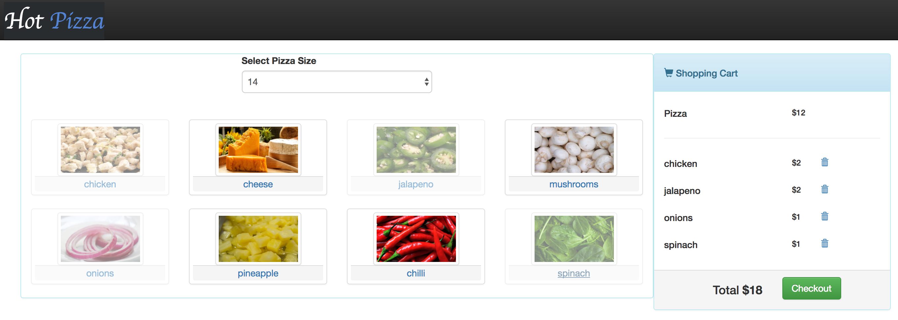

# pizza_store

<strong><u>Project Overview:</u></strong>
This is an Online Pizza Store application. This application has the following customer facing functionalities.
<ul>
	<li>Log-In: Lets a customer to log into his account</li>
	<li>Shopping Cart: Lets a customer to select a pizza type with different toppings</li>
	<li>Checkout: Lets a customer to checkout using a CC</li>
	<li>Order Tracking (Real-Time): Lets a customer to track his order real-time as the pizza preparation and delivery process proceeds</li>
</ul>

This application has the following employee facing functionalities:
<ul>
	<li>Log-In: Lets an employee to log into his account</li>
	<li>Order Monitoring: Lets all employees to monitor the order queue</li>
	<li>Order Servicing: Lets an employees to pull one order at a time and service that order across multiple stages while providing real time updates to the customer</li>
</ul>

<strong><u>Technologies used:</u></strong>
<table>
	<tr>
		<td></td>
		<td></td>
		<td></td>
		<td></td>
		<td></td>
		<td></td>
	</tr>
	<tr>
		<td></td>
		<td></td>
		<td></td>
		<td></td>
		<td></td>
		<td></td>
		<td></td>
	</tr>
</table>

<strong><u>Work-Flow:</u></strong>

<ul>
	<li>Shopping cart: An overview of the pizza shopping functionality </li>
</ul>
